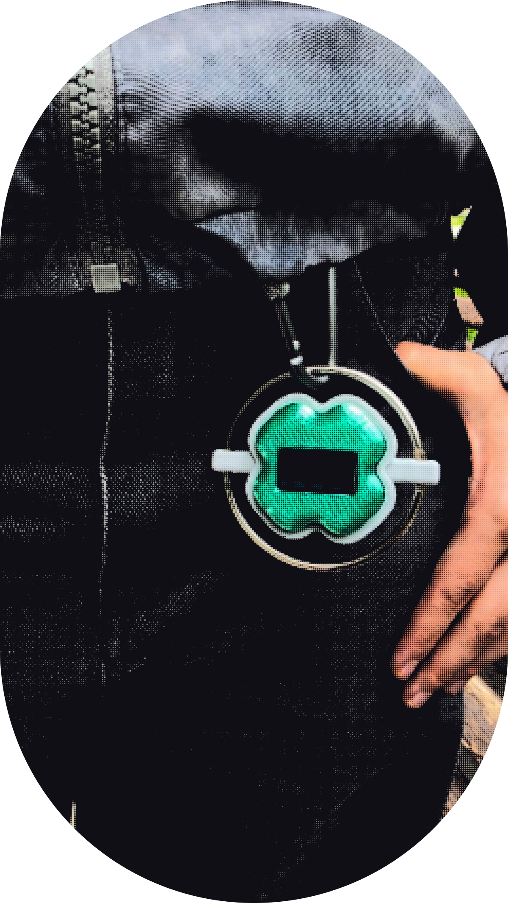

**English** | [Русский](README.ru.md)

# SmartMotion Keychain

[](https://github.com/espressif/esp-idf)
[](https://www.espressif.com/en/products/socs/esp32-c3)
[](main/main.c)
[](android_time_sync)
[](docs/ARCHITECTURE.md)
[](docs/HARDWARE.md)

A tiny motion-reactive ESP32-C3 keychain with an OLED display, an MPU-6050
sensor, BLE time synchronization, low-power behavior, and a tilt-controlled
Breakout game.

It started as a Tamagotchi-like keychain idea: a small physical object that
reacts to movement, falls asleep when left still, wakes up when picked up,
shows useful information, and turns into a miniature motion-controlled game.




| | |
|---|---|
| **Status** | Functional hardware prototype |
| **Firmware** | ESP-IDF 6.0.1 / ESP32-C3 |
| **Companion app** | Android 8.0+ |
| **Display** | 0.96-inch 128x64 OLED |

## Why I Built This

This project started as a personal device idea: a keychain that feels less like
a utility and more like a tiny digital object with its own behavior. I used it
to explore embedded firmware architecture, motion sensing, BLE communication,
low-power design, Android integration, and early product prototyping in one
connected system.

## Highlights

- Motion-reactive `FLUID` particle animation.
- `SLEEP` and Light Sleep modes after inactivity.
- Hardware wake-up through the MPU-6050 interrupt pin.
- Triple-shake gesture that opens a short BLE connection window.
- Time synchronization from an Android phone.
- Time screen with date, step count, and sync status.
- Tilt-controlled Breakout with procedurally generated levels.
- Modular ESP-IDF components instead of a monolithic `main.c`.
- On-demand BLE lifecycle designed for battery-powered operation.

## Demo Behavior

| Mode | What happens |
|---|---|
| `FLUID` | Particles react to keychain tilt |
| `SLEEP` | A dim, low-frame-rate idle animation starts after 30 seconds |
| Light Sleep | After another 30 seconds the OLED turns off; MPU-6050 remains the wake source |
| `TIME` | Displays time, date, steps, and synchronization status |
| `GAME` | Runs a tilt-controlled Breakout game locally on the ESP32-C3 |

A triple shake opens a temporary 60-second BLE window. Outside this window the
keychain does not advertise, reducing unnecessary radio use.

## Hardware at a Glance

- ESP32-C3 Super Mini.
- SSD1306-compatible 0.96-inch 128x64 OLED.
- MPU-6050 accelerometer/gyroscope module.
- Single-cell 3.7 V LiPo battery.
- Protected charger and regulated power converter.

The OLED and MPU-6050 share one 200 kHz I2C bus:

| Signal | ESP32-C3 |
|---|---:|
| SDA | `GPIO5` |
| SCL | `GPIO6` |
| MPU-6050 INT | `GPIO4` |

Expected devices:

```text
0x3C  OLED
0x68  MPU-6050
```

Detailed wiring, OLED I2C conversion, power connections, and current
measurement are documented in [docs/HARDWARE.md](docs/HARDWARE.md).

## Architecture

```text
Android app
    |
    | BLE GATT: time / GAME:START
    v
phone_sync (NimBLE)
    |
    v
main state machine
    +-- FLUID -> flip_animation
    +-- SLEEP -> idle_animation
    +-- TIME  -> time_animation + device_clock + step_counter
    +-- GAME  -> breakout_game
    |
    +-- mpu6050 -> motion_detector -> wake / shake / tilt
    +-- oled_display -> SSD1306 framebuffer -> shared I2C
```

### Component Boundaries

| Component | Responsibility |
|---|---|
| `board_config` | GPIO assignments, addresses, and bus settings |
| `i2c_bus` | Shared bus lifecycle and startup validation |
| `mpu6050` | Sensor register access and low-power wake mode |
| `motion_detector` | Movement, inactivity, and triple-shake detection |
| `motion_state` | `FLUID/SLEEP/TIME/GAME` transitions |
| `oled_display` | SSD1306 framebuffer and transfer |
| `flip_animation` | Active motion-reactive animation |
| `idle_animation` | Low-power idle animation |
| `time_animation` | Clock, date, and step screen |
| `breakout_game` | Game state, collision physics, and random levels |
| `phone_sync` | On-demand BLE GATT service |
| `android_time_sync` | Android companion application |

The complete execution model, BLE command flow, and design invariants are in
[docs/ARCHITECTURE.md](docs/ARCHITECTURE.md).

## Gallery

| Motion demo | Concept render |
|---|---|
|  |  |

The current media shows the interaction concept and enclosure direction.
Photographs of the assembled electronics will be added after enclosure
integration.

## Quick Start

### Requirements

- ESP-IDF 6.0.1 with the ESP32-C3 toolchain.
- Python, CMake, and Ninja managed by ESP-IDF.
- Android Studio with JDK 17 and Android SDK 35 for the companion app.

### Build and Flash

```powershell
git clone https://github.com/Godcomplexx/Keychain_motion.git
cd Keychain_motion

. $env:IDF_PATH\export.ps1
idf.py set-target esp32c3
idf.py build
idf.py -p COM13 flash monitor
```

Replace `COM13` with the board's actual port. Close the monitor with `Ctrl+]`.

A healthy startup reports:

```text
i2c_bus: Found I2C device at address 0x3C
i2c_bus: Found I2C device at address 0x68
i2c_bus: I2C scan complete: 2 device(s) found
```

## Android Companion App

Build from Android Studio by opening `android_time_sync`, or use:

```powershell
cd android_time_sync
$env:ANDROID_HOME = "$env:LOCALAPPDATA\Android\Sdk"
.\gradlew.bat assembleDebug
```

The APK is generated at:

```text
android_time_sync/app/build/outputs/apk/debug/app-debug.apk
```

### Auto Sync

1. Grant Bluetooth and notification permissions.
2. Tap `Start auto sync`.
3. Perform a triple shake.
4. The app discovers `KeychainSync`, sends local phone time, and disconnects.

Background synchronization uses Android's low-power BLE scan mode. Explicit
manual commands use the faster balanced mode.

### Breakout

1. Tap `Start Breakout`.
2. Perform a triple shake.
3. The phone sends `GAME:START`.
4. BLE powers down and gameplay continues locally.
5. Tilt the keychain left and right to move the paddle.

Breakout has three lives, generated levels, increasing speed, and no fixed
active-play time limit. It exits after five minutes without paddle input.

## Power Model

The firmware reduces average current without removing the interactive modes:

- FLUID switches to SLEEP after 30 seconds without movement;
- the OLED turns off after another 30 seconds;
- MPU-6050 enters low-power motion detection;
- `INT` wakes the ESP32-C3 when the keychain moves;
- BLE starts only after a triple shake and shuts down after a command;
- Breakout runs with BLE disabled.

For a six-hour target with a 350 mAh battery:

```text
maximum average current = 350 mAh / 6 h = 58.3 mA
```

Actual runtime must be measured on assembled hardware. USB Serial/JTAG prevents
Light Sleep, so battery measurements must be performed with USB disconnected.

## Verification

```powershell
idf.py build

cd android_time_sync
.\gradlew.bat lintDebug assembleDebug
```

Hardware checklist:

- I2C scan detects `0x3C` and `0x68`;
- FLUID and Breakout respond to tilt;
- inactivity reaches SLEEP and Light Sleep;
- MPU-6050 motion wakes the controller;
- Auto Sync updates the clock;
- BLE powers down after time or game commands.

## Documentation

- [Architecture and software design](docs/ARCHITECTURE.md)
- [Hardware, wiring, power, and diagnostics](docs/HARDWARE.md)

## Roadmap and Known Limitations

- Measure current in every operating mode and publish real battery-life data.
- Calibrate step counting for different keychain orientations.
- Add automated host-side tests for state and game logic.
- Add repeatable hardware-in-the-loop checks for OLED, MPU-6050, and BLE.
- Prepare a release-signed Android build if the companion app is distributed.
