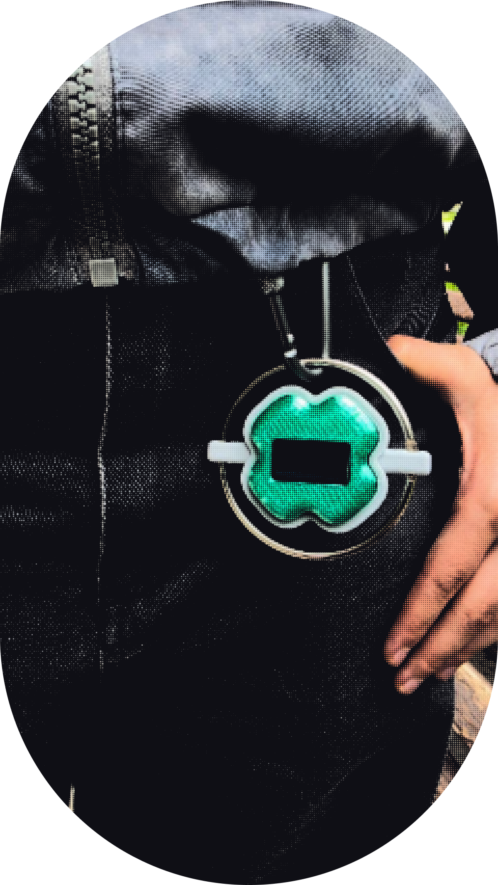
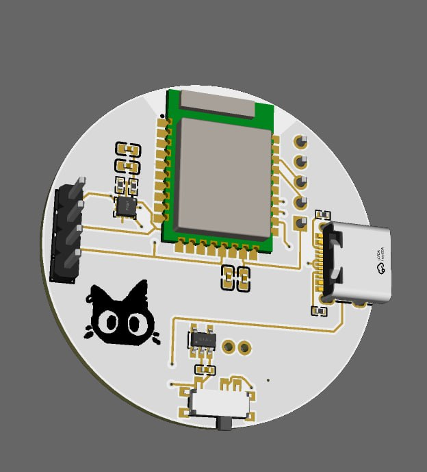
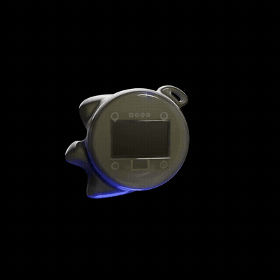

**English** | [Русский](README.ru.md)

# SmartMotion Keychain

[](https://github.com/espressif/esp-idf)
[](xiao_nrf52840)
[](main/main.c)
[](android_time_sync)
[](docs/ARCHITECTURE.md)
[](tools/flash/README.md)
[](docs/HARDWARE.md)

A tiny motion-reactive keychain with an OLED display, BLE time synchronization
from an Android phone, low-power behavior, and a tilt-controlled Breakout game.

It started as a Tamagotchi-like keychain idea: a small physical object that
reacts to movement, falls asleep when left still, wakes up when picked up,
shows useful information, and turns into a miniature motion-controlled game.

The project exists in two firmware versions. **Version 1** is the ESP32-C3
prototype that established the behavior on a breadboard. **Version 2** runs on
a custom nRF52840 board and replaces the fixed screens with a procedural
character that has moods, blinks, invents small activities when left alone, and
remembers recent interaction.

| | |
|---|---|
|  |  |

| | |
|---|---|
| **Status** | Functional hardware prototype |
| **v1 firmware** | ESP-IDF 6.0.1 / ESP32-C3 |
| **v2 firmware** | Zephyr 4.2 / nRF52840 on a custom PCB |
| **Companion app** | Android 8.0+ |
| **Display** | 0.96-inch 128x64 OLED |

## Why I Built This

This project started as a personal device idea: a keychain that feels less like
a utility and more like a tiny digital object with its own behavior. I used it
to explore embedded firmware architecture, motion sensing, BLE communication,
low-power design, Android integration, and early product prototyping in one
connected system.

---

# Version 2 — Current

A procedural companion on a custom PCB. Version 1, further down this page, used
four fixed screens selected by a motion state machine; version 2 replaces them
with a character.

| The board | The enclosure |
|---|---|
|  |  |

Both are renders: the board as laid out, and the enclosure it is meant to live
in. The cat on the silkscreen and the ears on the case are the same idea from
two directions.

## The Software

The screen is no longer chosen by "which mode is active" but by "what is the
character doing, and what is allowed to interrupt it". Every frame is computed
from a behavior identifier and how long it has been running, so there are no
sprite sheets and a new mood costs one `switch` case.

```text
event  ->  priority P0..P3  ->  behavior  ->  animation
```

| Component | Responsibility |
|---|---|
| `pet_behavior` | events, priorities, wrap-safe timers, interaction memory. Plain C, no RTOS types |
| `pet_face` | procedural eyes: size, lids, gaze, blinking, overlays. Knows nothing about events |

Inputs are deliberately of two kinds. **Events** happen once and are posted:
shaken, picked up, charger attached, phone synced. **Context** is level-triggered
and passed every tick: sensor present, charging, battery level. Sending a level
condition as an event is the classic bug - the animation restarts every tick and
never finishes.

| Event | Reaction | Priority |
|---|---|---:|
| picked up after stillness | eyes snap open, glance up | P1 |
| tilted left / right | the gaze eases across and **stays there** while held | P1 |
| one sharp jolt | startled: eyes go wide, the face hops | P1 |
| deliberate shaking | annoyed: slanted brows and a short tremble | P1 |
| tipped steeply and held 1.5 s | starts the particle game | P3 |
| charger attached | happy arcs and sparkles, then a battery gauge | P1 |
| phone synced the clock | a nod, then visible pleasure | P1 |
| BLE window open | the eyes track a scanning line | P1 |
| left alone 30 s | bored: smaller eyes, wandering gaze, slow sighs | P2 |
| left alone 5 min | asleep: eye slits and rising `z` | P2 |
| left alone longer | one of two self-directed activities, listed below | P3 |

A higher priority interrupts a lower one immediately and is never pushed aside
by it. Any deliberate interaction cancels a P3 activity in the same tick.

### Being alone, and playing together

These are different things, and they are kept apart on purpose.

**Self-directed activities** are what the pet does to occupy itself when nobody
is around. There are two:

| Activity | On screen | Length |
|---|---|---:|
| `act_stargaze` | the gaze goes up while dots drift upward from below | 9 s |
| `act_wander` | the gaze walks a slow circle, as if thinking | 7 s |

One starts after 45 seconds without interaction, or 20 if the accelerometer is
not soldered, so that something still happens on screen. Then a 40-120 second
pause; the same activity never repeats more often than once per 5 minutes, and
never twice in a row. Any interaction ends an activity in the same tick.

**The FLIP particle animation is a game, not an activity.** It is played by
tilting, which takes a person. A pet starting a two-player game on its own would
be stranger than silence, so the scheduler never picks it.

It is summoned deliberately instead: from the phone, by pressing
`Start Breakout`, or - when `PLAY_GESTURE_ENABLED` is switched back to 1 in
[main.c](xiao_nrf52840/src/main.c) - by tipping the keychain steeply and holding
for a second and a half, the way you tip a glass. The gesture is off by default
so the face can be judged on its own: FLIP takes the whole display for 30
seconds at a time. Tilting during the game counts as the controller: it neither
ends the game nor makes the pet glance sideways instead.

**It still depends on the accelerometer.** Without a sensor the gesture is
impossible, and the particles fall back to a synthetic tilt sweep: they move,
but react to nothing. Soldering the sensor restores real tilt with no firmware
change.

**Interaction memory.** A `bond` value of 0-100 rises with handling and decays
over hours. A higher bond widens the eyes slightly, blinks a little more often,
delays boredom and makes self-directed activities start sooner. The pet becomes
visibly livelier when it is used, and calms down again when it is not.

**It stays alive without the accelerometer.** With no sensor present, deep sleep
is disabled - nothing could wake the face again, and a frozen screen reads as a
crash - and self-directed activities are scheduled far more often so something
is always happening. Soldering the sensor later needs no firmware change.

**The phone starts things; the keychain no longer volunteers.** Version 1 showed
the clock whenever it was shaken and counted steps all day. Version 2 does
neither. Setting the clock over BLE is silent - it corrects the time and leaves
the face alone - and the clock appears only when `Show time` is pressed in the
app. `Start Breakout` still opens the game, and `Draw pad` turns the screen into
a sheet of paper the phone draws on.

For a button press to arrive, the keychain has to be reachable at the moment it
is pressed, so it advertises whenever it is not playing, retrying every five
seconds. The old rule - advertise for 60 seconds after a triple shake - meant
every button press had to be preceded by shaking the keychain awake. Shaking
still helps in one case: it brings the radio back immediately after a game
instead of waiting out the retry interval.

## Hardware and Updates

Version 2 runs on a 40 mm round two-layer PCB built around an EBYTE
E73-2G4M08S1C module, with a LIS2DW12 accelerometer at `0x18`, USB-C, a LiPo
charger and a power switch. The module carries no factory bootloader, so the
first firmware goes in over SWD through connector `J3`.

The firmware uses four board signals: I2C on `P0.06`/`P0.08`, battery sense on
`P0.02` (`AIN0`) behind the `R17`/`R18` divider, the accelerometer interrupt on
`P0.07`, and charger detection through the SoC's own `USBREGSTATUS` register,
which answers even for a charger that never enumerates. The module pin mapping
comes from the EBYTE manual and was cross-checked against the Gerber netlist;
the table is in [xiao_nrf52840/README.md](xiao_nrf52840/README.md).

```text
0x000000  mcuboot   64 KB
0x010000  image-0  448 KB   the running application
0x080000  image-1  448 KB
0x0F0000  storage   64 KB
```

There are two update routes, and they behave differently.

**Normal - through the running application.** The application exposes an SMP
server on a second USB port. The image goes into the spare slot as a *test*
image, MCUboot swaps it in, and the application confirms itself only if it
started successfully. An image that never gets that far is put back by MCUboot
at the next reset. That is the rollback.

**Recovery - through the bootloader.** The board has no RESET button, so DFU is
not entered by holding anything: the application receives a 1200-baud touch on
its console port, writes a boot-mode flag into a register that survives the
reset, and MCUboot reads it and starts serial recovery. That path keeps no slot
state, so whatever is written becomes permanent immediately - it exists for when
the application no longer starts.

Both application ports live on one USB device and are told apart by interface
number: `MI_00` is the console, `MI_02` is the SMP server.

The same change gave the board a console it never had: behavior transitions now
come out of the USB-C connector.

```text
I (oled): SSD1306 ready at 0x3C
I (keychain): pet: unknown -> connecting priority=P1 bond=0
I (keychain): pet: connecting -> charging priority=P2 bond=0
```

## Build and Flash

Requires a Zephyr 4.2 workspace with the `mcuboot`, `zcbor` and `mbedtls`
modules, plus `pip install pyocd hidapi smpmgr`.

```powershell
# one time, over SWD: erase, install MCUboot and the signed application
python tools/flash/flash_nrf52840.py bootstrap

# every update after that, over the board's own USB-C connector
python tools/flash/usb_update.py

# read chip identity, lock state and which image is executing
python tools/flash/flash_nrf52840.py info
```

The exact CMake invocations for the bootloader and the signed application, the
pyOCD workaround needed to reach Nordic's CTRL-AP through an ST-Link, and the
diagnostics are in [tools/flash/README.md](tools/flash/README.md). Firmware
details for the port are in [xiao_nrf52840/README.md](xiao_nrf52840/README.md).

## What Version 2 Does Not Do Yet

- The accelerometer is not soldered on the current board, so every motion
  reaction above is implemented and compiled but unverified on hardware.
- Automatic revert has only been verified from the top: the image is seen to
  arrive unconfirmed and to confirm itself on a successful start. A deliberately
  broken image has not been used to provoke the revert itself.
- Charge is computed from voltage, and that method cannot be made much better:
  a hundred millivolts halves the charge in the middle of a LiPo curve. The
  display writes the percentage next to the gauge; while charging, 60 mV is
  subtracted first, because that is how much the charge current lifts the
  terminal voltage and leaving it in would read about ten points high. That
  figure was measured on this board rather than looked up, and another cell
  would need a different one.

---

# Version 1 — ESP32-C3 Prototype

The original breadboard prototype. It still builds and runs, and it is where the
motion behavior, the BLE protocol and the Android app were developed.

## Highlights

- Motion-reactive `FLUID` particle animation.
- `SLEEP` and Light Sleep modes after inactivity.
- Hardware wake-up through the MPU-6050 interrupt pin.
- Triple-shake gesture that opens a short BLE connection window.
- Time synchronization from an Android phone.
- Time screen with date, step count, and sync status.
- Tilt-controlled Breakout with procedurally generated levels.
- Modular ESP-IDF components instead of a monolithic `main.c`.
- On-demand BLE lifecycle designed for battery-powered operation.

## Demo Behavior

| Mode | What happens |
|---|---|
| `FLUID` | Particles react to keychain tilt |
| `SLEEP` | A dim, low-frame-rate idle animation starts after 30 seconds |
| Light Sleep | After another 30 seconds the OLED turns off; MPU-6050 remains the wake source |
| `TIME` | Displays time, date, steps, and synchronization status |
| `GAME` | Runs a tilt-controlled Breakout game locally on the ESP32-C3 |
| `DRAW` | Mirrors what the phone's drawing pad is drawing |

A triple shake opens a temporary 60-second BLE window. Outside this window the
keychain does not advertise, reducing unnecessary radio use. Version 2 dropped
this in favour of continuous slow advertising, so that a button press in the app
always has somewhere to arrive.

## Hardware at a Glance

- ESP32-C3 Super Mini.
- SSD1306-compatible 0.96-inch 128x64 OLED.
- MPU-6050 accelerometer/gyroscope module.
- Single-cell 3.7 V LiPo battery.
- Protected charger and regulated power converter.

The OLED and MPU-6050 share one 300 kHz I2C bus:

| Signal | ESP32-C3 |
|---|---:|
| SDA | `GPIO5` |
| SCL | `GPIO6` |
| MPU-6050 INT | `GPIO4` |

Expected devices:

```text
0x3C  OLED
0x68  MPU-6050
```

Detailed wiring, OLED I2C conversion, power connections, and current
measurement are documented in [docs/HARDWARE.md](docs/HARDWARE.md).

## Architecture

```text
Android app
    |
    | BLE GATT: time / GAME:START
    v
phone_sync (NimBLE)
    |
    v
main state machine
    +-- FLUID -> flip_animation
    +-- SLEEP -> idle_animation
    +-- TIME  -> time_animation + device_clock + step_counter
    +-- GAME  -> breakout_game
    |
    +-- mpu6050 -> motion_detector -> wake / shake / tilt
    +-- oled_display -> SSD1306 framebuffer -> shared I2C
```

### Component Boundaries

| Component | Responsibility |
|---|---|
| `board_config` | GPIO assignments, addresses, and bus settings |
| `i2c_bus` | Shared bus lifecycle and startup validation |
| `mpu6050` | Sensor register access and low-power wake mode |
| `motion_detector` | Movement, inactivity, and triple-shake detection |
| `motion_state` | `FLUID/SLEEP/TIME/GAME` transitions |
| `oled_display` | SSD1306 framebuffer and transfer |
| `flip_animation` | Active motion-reactive animation |
| `idle_animation` | Low-power idle animation |
| `time_animation` | Clock, date, and step screen |
| `breakout_game` | Game state, collision physics, and random levels |
| `draw_pad` | The canvas the phone's drawing pad writes to |
| `phone_sync` | On-demand BLE GATT service |
| `android_time_sync` | Android companion application |

The complete execution model, BLE command flow, and design invariants are in
[docs/ARCHITECTURE.md](docs/ARCHITECTURE.md).

## Build and Flash

Requires ESP-IDF 6.0.1 with the ESP32-C3 toolchain, and Python, CMake and Ninja
managed by ESP-IDF.

```powershell
git clone https://github.com/Godcomplexx/Keychain_motion.git
cd Keychain_motion

. $env:IDF_PATH\export.ps1
idf.py set-target esp32c3
idf.py build
idf.py -p COM13 flash monitor
```

Replace `COM13` with the board's actual port. Close the monitor with `Ctrl+]`.

A healthy startup reports:

```text
i2c_bus: Found I2C device at address 0x3C
i2c_bus: Found I2C device at address 0x68
i2c_bus: I2C scan complete: 2 device(s) found
```

## Power Model

The firmware reduces average current without removing the interactive modes:

- FLUID switches to SLEEP after 30 seconds without movement;
- the OLED turns off after another 30 seconds;
- MPU-6050 enters low-power motion detection;
- `INT` wakes the ESP32-C3 when the keychain moves;
- BLE starts only after a triple shake and shuts down after a command
  (version 2 advertises slowly all the time instead);
- Breakout runs with BLE disabled.

For a six-hour target with a 350 mAh battery:

```text
maximum average current = 350 mAh / 6 h = 58.3 mA
```

Actual runtime must be measured on assembled hardware. USB Serial/JTAG prevents
Light Sleep, so battery measurements must be performed with USB disconnected.

## Verification

```powershell
idf.py build

cd android_time_sync
.\gradlew.bat lintDebug assembleDebug
```

Hardware checklist:

- I2C scan detects `0x3C` and `0x68`;
- FLUID and Breakout respond to tilt;
- inactivity reaches SLEEP and Light Sleep;
- MPU-6050 motion wakes the controller;
- Auto Sync updates the clock;
- BLE powers down after time or game commands.

---

# Shared Across Both Versions

## Android Companion App

The BLE GATT protocol is identical on both firmware versions, so the same app
drives either board.

Build from Android Studio by opening `android_time_sync`, or use:

```powershell
cd android_time_sync
$env:ANDROID_HOME = "$env:LOCALAPPDATA\Android\Sdk"
.\gradlew.bat assembleDebug
```

The APK is generated at:

```text
android_time_sync/app/build/outputs/apk/debug/app-debug.apk
```

The app has four buttons: `Start auto sync`, `Show time`,
`Start Breakout` and `Draw pad`.

### Auto Sync

1. Grant Bluetooth and notification permissions.
2. Tap `Start auto sync`.
3. The app discovers `KeychainSync`, sends local phone time, and disconnects.

On version 2 the keychain advertises continuously, so this needs no gesture. On
version 1 a triple shake is still required to open the radio window.

Background synchronization uses Android's low-power BLE scan mode. Explicit
manual commands use the faster balanced mode. Setting the clock is silent on the
device - it does not take the screen.

### Show the Clock

1. Tap `Show time`.
2. The phone sends `TIME:SHOW`.
3. The keychain switches to the clock screen for 60 seconds; the radio stays up,
   because the next button press has to have somewhere to arrive.

With auto sync on, the request is queued and sent at the next BLE window, and the
notification tracks it. Without auto sync the app connects once, immediately.

### Draw Pad

1. Tap `Draw pad`.
2. Draw on the black rectangle. The stroke appears on the keychain as you move.
3. `Clear` wipes both. `Done` closes the pad and hands the screen back.

The preview is a 128x64 bitmap scaled up without smoothing, and it rasterizes
lines with the same Bresenham walk and round nib the firmware uses, so it shows
the pixels the OLED will actually light rather than a smooth phone-quality line
that turns out chunky on arrival.

What travels over BLE is the stroke, not the picture: one opcode byte and two
bytes per point, batched every 40 ms into a single write. Sending the 1024-byte
framebuffer instead would need chunking and reassembly for an image that is
almost entirely blank. The connection stays open for as long as the pad does -
reconnecting per stroke would cost a second each time - and the MTU is
negotiated up to 247 bytes, which is the difference between 9 points per packet
and 120.

There is a way to test all of this without the phone:

```powershell
pip install bleak
python tools/draw_test.py
```

It draws a wave and a box over the same protocol the app uses and prints the
characteristics it found, which separates a firmware problem from an app one.

The keychain leaves the pad when the app says so, when the phone disconnects, or
after five minutes without a packet. Auto sync pauses while the pad is open,
because the keychain accepts one connection at a time.

### Breakout

1. Tap `Start Breakout`.
2. The phone sends `GAME:START`.
3. BLE powers down and gameplay continues locally.
4. Tilt the keychain left and right to move the paddle.

Breakout has three lives, generated levels, increasing speed, and no fixed
active-play time limit. It exits after five minutes without paddle input.

## Gallery

| Motion demo | Concept render | ASCII particle effect |
|---|---|---|
|  |  |  |

These show version 1 running. The version 2 board and enclosure appear as
renders further up; photographs of the assembled version 2 hardware will be
added once the accelerometer is soldered and the case is printed.

## Attribution

The procedural face's lid vocabulary - flat lids, the lower lid, and the glare,
a triangular brow dropping towards the nose - is ported from the Pip eye engine.

> Originally created by Hamza Yeşilmen (HamzaYslmn).
> Source: https://github.com/HamzaYslmn/
> Sponsor: https://github.com/sponsors/HamzaYslmn

The licence text is preserved in
[THIRD_PARTY_LICENSES/esp-bridge-mcp-robot-LICENSE.txt](THIRD_PARTY_LICENSES/esp-bridge-mcp-robot-LICENSE.txt).
This is a **modified derivative implementation**, not the original: the shapes
were rewritten in C for a 128x64 mono display and driven by a different
behaviour system.

Note that the licence is not OSI open source and permits **personal,
non-commercial use only**.

## Documentation

- [Architecture and software design](docs/ARCHITECTURE.md)
- [Hardware, wiring, power, and diagnostics](docs/HARDWARE.md)
- [nRF52840 port and companion behavior](xiao_nrf52840/README.md)
- [Flashing, USB updates and diagnostics](tools/flash/README.md)

## Portable Host Tests

The first native test exercises the platform-independent `pet_behavior`
component. Run it in a shell where a native C compiler and Ninja are available:

```powershell
cmake -S tests/host -B build-host -G Ninja
cmake --build build-host
ctest --test-dir build-host --output-on-failure
```

## Roadmap and Known Limitations

- Solder the LIS2DW12 and verify every motion reaction on the version 2 board.
- Configure an ADC channel on `BAT_SENSE` so the battery gauge shows a real
  level and the low-battery mood can trigger.
- Declare the `ACC_INT1` interrupt so hardware wake-up works on version 2.
- Generate a private MCUboot signing key instead of the published development
  key.
- Measure current in every operating mode and publish real battery-life data.
- Calibrate step counting for different keychain orientations.
- Expand automated host-side coverage beyond `pet_behavior` to state and game logic.
- Prepare a release-signed Android build if the companion app is distributed.
