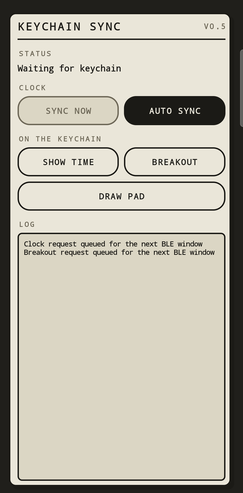
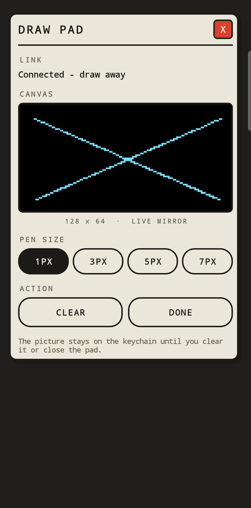

[English](README.md) | **Русский**

# SmartMotion Keychain

[](https://github.com/espressif/esp-idf)
[](xiao_nrf52840)
[](main/main.c)
[](android_time_sync)
[](docs/ARCHITECTURE.md)
[](tools/flash/README.md)
[](docs/HARDWARE.md)

SmartMotion Keychain — маленький интерактивный брелок с OLED-дисплеем и
датчиком движения. Он реагирует на наклон, засыпает при бездействии,
синхронизирует время с Android-приложением по BLE и запускает мини-игру
Breakout с управлением движением.

Идея проекта похожа на карманный Tamagotchi: это небольшой физический объект,
который ощущает движение, оживает в руках, засыпает в покое и объединяет
embedded-прошивку, электронику и мобильное приложение.

Проект существует в двух версиях прошивки. **Версия 1** — прототип на ESP32-C3,
на котором отработано всё поведение. **Версия 2** работает на собственной плате
с nRF52840 и заменяет фиксированные экраны процедурным персонажем: у него есть
настроения, он моргает, сам придумывает себе занятия, когда его не трогают, и
помнит недавнее общение.

| | |
|---|---|
|  |  |

| | |
|---|---|
| **Статус** | Рабочий аппаратный прототип |
| **Прошивка v1** | ESP-IDF 6.0.1 / ESP32-C3 |
| **Прошивка v2** | Zephyr 4.2 / nRF52840 на своей плате |
| **Приложение** | Android 8.0+ |
| **Дисплей** | OLED 0.96", 128x64 |

## Зачем я сделала этот проект

Проект начался как идея личного устройства: брелока, который ощущается не
просто инструментом, а маленьким цифровым объектом со своим поведением. На
одном связанном прототипе я объединила архитектуру embedded-прошивки, датчик
движения, BLE, энергосбережение, Android-интеграцию и раннюю продуктовую
разработку.

---

# Версия 2 — актуальная

Процедурный компаньон на собственной плате. Версия 1, описанная ниже на этой
странице, использовала четыре фиксированных экрана, которые выбирала машина
состояний; версия 2 заменяет их персонажем.

| Плата | Корпус |
|---|---|
|  |  |

И то и другое — рендеры: плата в разведённом виде и корпус, в котором ей
предстоит жить. Кот на шелкографии и уши на корпусе — одна и та же мысль с двух
сторон.

## Прошивка

Экран теперь выбирается не по принципу «какой режим включён», а по принципу
«что персонаж сейчас делает и что имеет право его прервать». Каждый кадр
считается из идентификатора поведения и времени, которое оно уже идёт, поэтому
спрайтов нет, а новое настроение стоит одной ветки `switch`.

```text
событие  ->  приоритет P0..P3  ->  поведение  ->  анимация
```

| Компонент | Ответственность |
|---|---|
| `pet_behavior` | события, приоритеты, таймеры, память о взаимодействиях. Чистый C, без типов RTOS |
| `pet_face` | процедурные глаза: размер, веки, взгляд, моргание, оверлеи. Про события не знает |

Входы намеренно разделены на два вида. **События** происходят один раз и
отправляются: встряхнули, взяли в руку, подключили зарядку, телефон
синхронизировал время. **Контекст** длится и передаётся каждый тик: есть ли
датчик, идёт ли зарядка, какой заряд. Отправить длящееся условие как событие —
классическая ошибка: анимация перезапускается каждый тик и никогда не кончается.

| Событие | Реакция | Приоритет |
|---|---|---:|
| взяли в руку после покоя | глаза распахиваются, взгляд вверх | P1 |
| наклонили влево / вправо | взгляд едет в сторону и **остаётся там**, пока держите | P1 |
| один резкий толчок | пугается: глаза круглые, подпрыгивает | P1 |
| намеренная тряска | сердится: брови к центру, короткая дрожь | P1 |
| `Start Breakout` в приложении | запускает игру с частицами | P3 |
| подключили зарядку | глаза-дуги и искры, затем индикатор заряда | P1 |
| телефон синхронизировал время | кивок, затем радость | P1 |
| открылось BLE-окно | глаза следят за линией сканирования | P1 |
| 30 секунд не трогали | скучает: глаза меньше, взгляд бродит, вздохи | P2 |
| 5 минут не трогали | спит: щёлочки и всплывающие `z` | P2 |
| дольше | одно из двух самостоятельных занятий, см. ниже | P3 |

Более высокий приоритет прерывает более низкий немедленно и сам никогда не
вытесняется им. Любое осознанное взаимодействие отменяет P3-занятие в тот же
тик.

### Занятия в одиночестве и игра вдвоём

Это разные вещи, и они разделены намеренно.

**Самостоятельные занятия** — то, чем питомец занимает себя, когда рядом никого
нет. Их два:

| Занятие | Что на экране | Длительность |
|---|---|---:|
| `act_stargaze` | взгляд уходит вверх, снизу вверх плывут точки | 9 с |
| `act_wander` | взгляд медленно ходит по кругу, будто задумался | 7 с |

Занятие начинается после 45 секунд без взаимодействия — или 20, если
акселерометр не припаян, чтобы на экране всё равно что-то происходило. Дальше
пауза 40–120 секунд, одно и то же занятие не чаще раза в 5 минут, два подряд
одинаковых не выпадают. Любое взаимодействие обрывает занятие в тот же тик.

**Анимация частиц FLIP — не занятие, а игра.** В неё играют наклоном, то есть
для неё нужен человек. Питомец, затевающий игру в одиночестве, выглядел бы
страннее молчания, поэтому планировщик её не выбирает никогда.

Вызывается она осознанно: из приложения кнопкой `Start Breakout` или — если
вернуть `PLAY_GESTURE_ENABLED` в 1 в [main.c](xiao_nrf52840/src/main.c) —
жестом: наклонить круто и подержать полторы секунды, как наклоняют стакан. Жест
по умолчанию выключен, чтобы можно было смотреть на само лицо: FLIP забирает
весь экран на 30 секунд. Наклон во время игры работает как управление: он не
отменяет её и не переключает питомца на разглядывание сторон.

**Зависимость от акселерометра осталась.** Без датчика жест невозможен, а
частицы получают синтетическую пилу наклона в состоянии покоя: они движутся, но
ни на что не реагируют. Припайка датчика возвращает настоящий наклон без
изменения прошивки.

**Память о взаимодействиях.** Значение `bond` от 0 до 100 растёт от общения и
затухает за часы. Чем оно выше, тем шире глаза, чаще моргание, позже скука и
раньше начинаются самостоятельные занятия. Питомец заметно оживает, когда им
пользуются, и успокаивается, когда нет.

**Работает без акселерометра.** Если датчика нет, глубокий сон отключается —
разбудить лицо было бы нечем, а застывший экран читается как зависание — и
занятия планируются заметно чаще, чтобы на экране всегда что-то происходило.
Припаять датчик позже можно без изменения прошивки.

**Инициатива у телефона, брелок сам ничего не навязывает.** Версия 1 показывала
время при каждой встряске и весь день считала шаги. Версия 2 не делает ни того,
ни другого. Установка времени по BLE проходит молча — часы корректируются, лицо
не трогается, — а сами часы появляются только по кнопке `Show time` в
приложении. `Start Breakout` по-прежнему открывает игру, а `Draw pad`
превращает экран в лист бумаги, на котором рисует телефон.

Чтобы нажатие дошло, брелок должен быть доступен именно в этот момент, поэтому
он рекламируется всё время, пока бодрствует, и ещё две минуты после засыпания —
вещь только что положили, кнопки должны продолжать работать. Оставленный в покое
брелок замолкает: предмет в кармане, круглосуточно объявляющий неизменный адрес,
это маяк для слежки, которого никто не просил. Поднимите его — радио вернётся.

Прежнее правило — окно на 60 секунд после тройной встряски — означало, что перед
каждым нажатием брелок надо было растрясти.

После подключения брелок просит перевести связь на кодированный PHY из
Bluetooth 5 — тот меняет скорость на дальность, отправляя каждый бит по
несколько раз. Запрашивается S=2: примерно вдвое дальше при вдвое меньшей
скорости, а не S=8, где вчетверо дальше, но в восемь раз медленнее — рисовашка
шлёт поток точек, и восьмую долю скорости было бы видно рукой. Попросить не
значит получить: телефон, который так не умеет, оставит связь на 1M, а прошивка
пишет в лог, на чём связь в итоге сошлась.

Дальность зависит и от мощности передатчика — здесь +8 dBm против нуля,
который Zephyr ставит по умолчанию.

Сама связь запрашивает интервал 15–30 мс и супервизор-таймаут четыре секунды.
Дефолт Zephyr просит 420 мс, что при интервале 45 мс терпит девять пропущенных
событий, и каждое соединение умирало примерно через секунду после того, как
периферия его запрашивала.

## Железо и обновление

Версия 2 работает на круглой двухслойной плате Ø40 мм вокруг модуля EBYTE
E73-2G4M08S1C, с акселерометром LIS2DW12 по адресу `0x18`, разъёмом USB-C,
зарядником LiPo и выключателем питания. Заводского бутлоадера в модуле нет,
поэтому первая прошивка заливается по SWD через разъём `J3`.

Прошивка использует четыре линии платы: I2C на `P0.06`/`P0.08`, замер батареи
на `P0.02` (`AIN0`) через делитель `R17`/`R18`, вход прерывания акселерометра
на `P0.07` и детект зарядки через регистр `USBREGSTATUS` самого SoC — он
отвечает даже на зарядник, который не энумерируется. Соответствие выводов
модуля сигналам взято из мануала EBYTE и сверено с нетлистом гербера, таблица
приведена в [xiao_nrf52840/README.md](xiao_nrf52840/README.md).

```text
0x000000  mcuboot   64 КБ
0x010000  image-0  448 КБ   работающее приложение
0x080000  image-1  448 КБ
0x0F0000  storage   64 КБ
```

Обновление идёт двумя маршрутами, и они ведут себя по-разному.

**Обычный — через работающее приложение.** Приложение держит SMP-сервер на
втором USB-порту. Образ уходит в запасной слот **тестовым**, MCUboot переключает
слоты, и приложение подтверждает себя, только если успешно стартовало. Образ,
который до этого не добрался, MCUboot возвращает обратно при следующем сбросе.
Это и есть откат.

**Аварийный — через бутлоадер.** Кнопки RESET на плате нет, поэтому в DFU не
входят удержанием чего-либо: приложение получает касание 1200 бод на консольном
порту, пишет флаг режима загрузки в регистр, переживающий сброс, а MCUboot
читает его и поднимает serial recovery. Этот путь не ведёт состояния слотов,
поэтому записанное становится постоянным сразу — он нужен, когда приложение уже
не запускается.

Оба порта приложения живут на одном USB-устройстве и различаются номером
интерфейса: `MI_00` — консоль, `MI_02` — SMP-сервер.

Это же изменение дало плате консоль, которой у неё не было: переходы поведений
теперь выходят из разъёма USB-C.

```text
I (oled): SSD1306 ready at 0x3C
I (keychain): pet: unknown -> connecting priority=P1 bond=0
I (keychain): pet: connecting -> charging priority=P2 bond=0
```

## Сборка и прошивка

Нужен воркспейс Zephyr 4.2 с модулями `mcuboot`, `zcbor` и `mbedtls`, плюс
`pip install pyocd hidapi smpmgr`.

Обновляться можно и по Bluetooth. Приложение держит SMP-сервер и на USB, и
на BLE, а Nordic nRF Connect Device Manager говорит на этом протоколе:
укажите ему `KeychainSync` и дайте тот же `zephyr.signed.bin`, что шлёт
USB-обновлялка. Без кабеля — а это важно, когда телефон и брелок делят один
порт.

```powershell
# один раз, по SWD: стирание, установка MCUboot и подписанного приложения
python tools/flash/flash_nrf52840.py bootstrap

# все последующие обновления — через собственный USB-C платы
python tools/flash/usb_update.py

# прочитать идентификатор чипа, состояние защиты и какой образ исполняется
python tools/flash/flash_nrf52840.py info
```

Точные команды CMake для бутлоадера и подписанного приложения, обход бага pyOCD
при доступе к CTRL-AP через ST-Link и диагностика — в
[tools/flash/README.md](tools/flash/README.md). Подробности порта — в
[xiao_nrf52840/README.md](xiao_nrf52840/README.md).

## Чего в версии 2 пока нет

- Акселерометр на текущей плате не припаян, поэтому все реакции на движение
  выше реализованы и собираются, но на железе не проверены.
- Автоматический возврат к предыдущему образу проверен только «сверху»: видно,
  что образ приходит неподтверждённым и подтверждает себя сам при удачном
  старте. Сам возврат заведомо нерабочим образом ещё не провоцировали.
- Заряд считается по напряжению, и точнее этот метод быть не может: в середине
  кривой LiPo сто милливольт меняют заряд вдвое. На экране рядом с индикатором
  пишется процент; во время зарядки из показания вычитается 60 мВ, на которые
  ток заряда приподнимает напряжение на выводах, иначе процент был бы завышен
  примерно на десять пунктов. Величина поправки измерена на этой плате, а не
  взята из справочника, и на другом аккумуляторе будет другой.

---

# Версия 1 — прототип на ESP32-C3

Исходный прототип на макетной плате. Он по-прежнему собирается и работает, и
именно на нём отработаны поведение при движении, протокол BLE и
Android-приложение.

## Главное

- Анимация частиц `FLUID`, реагирующая на наклон.
- Режимы `SLEEP` и Light Sleep при бездействии.
- Аппаратное пробуждение через `INT` MPU-6050.
- Тройное встряхивание для открытия короткого BLE-окна.
- Синхронизация времени с Android-телефоном.
- Экран времени, даты, шагов и статуса синхронизации.
- Breakout со случайными уровнями и управлением наклоном.
- Модульная архитектура ESP-IDF вместо монолитного `main.c`.
- BLE включается только по необходимости для экономии батареи.

## Как ведёт себя брелок

| Режим | Поведение |
|---|---|
| `FLUID` | Частицы перемещаются в зависимости от наклона |
| `SLEEP` | Через 30 секунд включается тусклая медленная анимация |
| Light Sleep | Ещё через 30 секунд OLED выключается, MPU-6050 остаётся источником пробуждения |
| `TIME` | Показывает время, дату, шаги и статус синхронизации |
| `GAME` | Локально запускает Breakout с управлением акселерометром |
| `DRAW` | Повторяет то, что рисуют в паде на телефоне |

Экран часов нарисован в том же языке, что и приложение: рамка-панель, заголовок
с чертой под ним, само показание втрое крупнее шрифта — чтобы схватывать
взглядом, — и полоса внизу, утекающая по мере того, как истекают пятнадцать
секунд. [preview_time_screen.c](tests/host/preview_time_screen.c) печатает этот
экран в ASCII на компьютере, тем же шрифтом, что и прошивка, так что вёрстку
можно оценить, ничего не заливая.

Тройное встряхивание открывает BLE на 60 секунд. В остальное время брелок не
рекламируется, поэтому радиомодуль не расходует энергию постоянно. В версии 2 от
этого отказались в пользу постоянной медленной рекламы, чтобы нажатие кнопки в
приложении всегда доходило.

## Оборудование

- ESP32-C3 Super Mini.
- OLED 0.96", 128x64, SSD1306-совместимый контроллер.
- Акселерометр/гироскоп MPU-6050.
- Одноэлементный LiPo-аккумулятор 3.7 В.
- Защищённое зарядное устройство и стабилизированный преобразователь.

OLED и MPU-6050 используют общую I2C-шину 300 кГц:

| Сигнал | ESP32-C3 |
|---|---:|
| SDA | `GPIO5` |
| SCL | `GPIO6` |
| MPU-6050 INT | `GPIO4` |

Ожидаемые устройства:

```text
0x3C  OLED
0x68  MPU-6050
```

Подробная схема подключения, перевод OLED на I2C, питание и измерение тока
описаны в [docs/HARDWARE.md](docs/HARDWARE.md).

## Архитектура

```text
Android-приложение
    |
    | BLE GATT: время / GAME:START
    v
phone_sync (NimBLE)
    |
    v
машина состояний main
    +-- FLUID -> flip_animation
    +-- SLEEP -> idle_animation
    +-- TIME  -> time_animation + device_clock + step_counter
    +-- GAME  -> breakout_game
    |
    +-- mpu6050 -> motion_detector -> пробуждение / встряхивание / наклон
    +-- oled_display -> буфер кадра SSD1306 -> общая I2C
```

### Границы компонентов

| Компонент | Ответственность |
|---|---|
| `board_config` | Назначение GPIO, адреса и параметры шины |
| `i2c_bus` | Жизненный цикл шины и проверка при старте |
| `mpu6050` | Доступ к регистрам датчика и режим пробуждения |
| `motion_detector` | Движение, бездействие и тройное встряхивание |
| `motion_state` | Переходы `FLUID/SLEEP/TIME/GAME` |
| `oled_display` | Буфер кадра SSD1306 и его передача |
| `flip_animation` | Активная анимация, реагирующая на движение |
| `idle_animation` | Экономичная анимация покоя |
| `time_animation` | Экран времени, даты и шагов |
| `breakout_game` | Состояние игры, физика столкновений и уровни |
| `draw_pad` | Холст, в который пишет рисовашка на телефоне |
| `phone_commands` | Что означает команда телефона — решение без исполнения |
| `phone_sync` | BLE GATT-сервис по требованию |
| `android_time_sync` | Android-приложение |

Полная модель выполнения, поток BLE-команд и инварианты описаны в
[docs/ARCHITECTURE.md](docs/ARCHITECTURE.md).

## Сборка и прошивка

Нужен ESP-IDF 6.0.1 с тулчейном ESP32-C3, а также Python, CMake и Ninja из
поставки ESP-IDF.

```powershell
git clone https://github.com/Godcomplexx/Keychain_motion.git
cd Keychain_motion

. $env:IDF_PATH\export.ps1
idf.py set-target esp32c3
idf.py build
idf.py -p COM13 flash monitor
```

Замените `COM13` на реальный порт платы. Монитор закрывается через `Ctrl+]`.

Успешный старт выглядит так:

```text
i2c_bus: Found I2C device at address 0x3C
i2c_bus: Found I2C device at address 0x68
i2c_bus: I2C scan complete: 2 device(s) found
```

## Энергопотребление

Прошивка снижает средний ток, не убирая интерактивные режимы:

- FLUID переходит в SLEEP через 30 секунд без движения;
- ещё через 30 секунд выключается OLED;
- MPU-6050 переходит в режим детекции движения;
- `INT` будит ESP32-C3 при движении брелока;
- BLE включается только после тройного встряхивания и выключается после команды
  (в версии 2 вместо этого медленная реклама всё время);
- Breakout работает с выключенным BLE.

Для цели в шесть часов работы от аккумулятора 350 мА·ч:

```text
максимальный средний ток = 350 мА·ч / 6 ч = 58.3 мА
```

Реальное время работы нужно измерить на собранном устройстве. USB Serial/JTAG
блокирует Light Sleep, поэтому замеры делаются с отключённым USB.

## Проверка

```powershell
idf.py build

cd android_time_sync
.\gradlew.bat lintDebug assembleDebug
```

Аппаратный чек-лист:

- сканирование I2C находит `0x3C` и `0x68`;
- FLUID и Breakout реагируют на наклон;
- бездействие приводит к SLEEP и Light Sleep;
- движение MPU-6050 будит контроллер;
- Auto Sync обновляет часы;
- BLE выключается после команд времени или игры.

---

# Общее для обеих версий

## Android-приложение

Протокол BLE GATT одинаков в обеих версиях прошивки, поэтому одно и то же
приложение работает с любой платой.

| Панель | Рисовашка |
|---|---|
|  |  |

Всё, что умеет приложение, помещается в одну панель: часы, две вещи, которые
можно попросить брелок показать, и лог того, что на самом деле сделало радио.
Залитая таблетка означает «включено» — на снимке это `AUTO SYNC`.

Интерфейс собран кодом, а не в XML, см.
[RetroUi.java](android_time_sync/app/src/main/java/com/smartmotion/keychaintimesync/RetroUi.java):
всё приложение написано так же, а разделение означало бы, что для каждого
экрана надо держать в согласии и файл разметки, и Java.

На холст стоит посмотреть внимательнее: это растр 128x64, увеличенный без
сглаживания, и штрихи в нём растеризуются тем же алгоритмом Брезенхэма и тем же
круглым пером, что и в прошивке. Видно ровно те пиксели, которые зажжёт OLED, а
не гладкую «телефонную» линию, которая на месте окажется угловатой.

Иконка приложения генерируется из рисунка `docs/assets/icon-512.png` скриптом
[tools/make_app_icon.py](tools/make_app_icon.py): он обрезает картинку по
собственным границам и центрирует её — исходник смещён в своём холсте и как
иконка не годится.

Соберите проект в Android Studio, открыв `android_time_sync`, или командой:

```powershell
cd android_time_sync
$env:ANDROID_HOME = "$env:LOCALAPPDATA\Android\Sdk"
.\gradlew.bat assembleDebug
```

APK появится по пути:

```text
android_time_sync/app/build/outputs/apk/debug/app-debug.apk
```

Приложение — одна панель: `Sync now` и `Auto sync` для часов, дальше
`Show time`, `Breakout`, `Particles` и `Draw pad` для экрана брелока, поле
короткой записки и лог того, что сделало радио.

`Particles` — единственный вход в поле частиц. Жест наклона выключен, а сам
компаньон его не выбирает: в игру наклоном нужен человек.

Записка — до 26 символов: столько несёт одна командная запись и примерно
столько читаемо помещается на экране. Кегль выбирается сам: пара слов —
вдвое крупнее шрифта, длинная записка мельче, но целиком.

### Автоматическая синхронизация

1. Выдайте разрешения Bluetooth и уведомлений.
2. Нажмите `Start auto sync`.
3. Приложение находит `KeychainSync`, отправляет время телефона и отключается.

В версии 2 брелок рекламируется постоянно, поэтому жест не нужен. В версии 1
по-прежнему требуется тройное встряхивание, чтобы открыть радиоокно.

Фоновая синхронизация использует энергоэффективный режим сканирования BLE.
Явные ручные команды используют более быстрый сбалансированный режим. Установка
времени на устройстве проходит молча — экран она не занимает.

### Показать часы

1. Нажмите `Show time`.
2. Телефон отправляет `TIME:SHOW`.
3. Брелок переключается на экран часов на 15 секунд; радио остаётся включённым,
   потому что следующему нажатию нужно куда-то приходить.

При включённой автосинхронизации запрос ставится в очередь и уходит в ближайшее
BLE-окно, а уведомление показывает его состояние. Без автосинхронизации
приложение подключается сразу.

### Рисовашка

1. Нажмите `Draw pad`.
2. Рисуйте на чёрном прямоугольнике — штрих появляется на брелоке по ходу
   движения.
3. `Clear` стирает и там, и там. `Done` закрывает пад и отдаёт экран обратно.

Превью — это растровая картинка 128x64, увеличенная без сглаживания, и линии в
ней растеризуются тем же алгоритмом Брезенхэма и тем же круглым пером, что и в
прошивке. То есть видно ровно те пиксели, которые зажжёт OLED, а не гладкую
«телефонную» линию, которая на месте окажется угловатой.

По BLE едет штрих, а не картинка: байт кода операции и два байта на точку,
пачками раз в 40 мс одной записью. Слать 1024-байтовый фреймбуфер пришлось бы
кусками со сборкой на той стороне — ради изображения, которое почти целиком
пустое. Соединение держится всё время, пока пад открыт (переподключение на
каждый штрих стоило бы секунды), а MTU согласуется до 247 байт — это разница
между 9 точками в пакете и 120.

Всё это можно проверить без телефона:

```powershell
pip install bleak
python tools/draw_test.py
```

Скрипт рисует волну и рамку по тому же протоколу, что и приложение, и печатает
найденные характеристики — это сразу отделяет проблему в прошивке от проблемы в
приложении.

Брелок выходит из режима, когда приложение об этом сказало, когда телефон
отключился или когда пять минут не приходило ни одного пакета. Автосинхронизация
на время работы пада ставится на паузу: брелок принимает одно соединение.

### Breakout

1. Нажмите `Start Breakout`.
2. Телефон отправляет `GAME:START`.
3. BLE выключается, игра продолжается локально.
4. Наклоняйте брелок влево и вправо, чтобы двигать платформу.

В Breakout три жизни, генерируемые уровни, рост скорости и нет ограничения на
активную игру. Выход происходит после пяти минут без движения платформы.

## Галерея

| Демонстрация движения | Концепт-рендер | ASCII-эффект частиц |
|---|---|---|
|  |  |  |

Здесь показана работающая версия 1. Плата и корпус версии 2 приведены выше в
виде рендеров; фотографии собранного железа появятся, когда будет припаян
акселерометр и напечатан корпус.

## Благодарности

Словарь век процедурного лица — плоские веки, нижнее веко и `glare`, треугольная
бровь к переносице, — перенесён из движка глаз Pip.

> Originally created by Hamza Yeşilmen (HamzaYslmn).
> Source: https://github.com/HamzaYslmn/
> Sponsor: https://github.com/sponsors/HamzaYslmn

Текст лицензии сохранён в
[THIRD_PARTY_LICENSES/esp-bridge-mcp-robot-LICENSE.txt](THIRD_PARTY_LICENSES/esp-bridge-mcp-robot-LICENSE.txt).
Это **изменённая производная реализация**, а не оригинал: формы перенесены на C
под монохромный экран 128×64 и встроены в собственную систему поведений.

Обрати внимание: лицензия не является open-source в смысле OSI и разрешает
**только личное некоммерческое использование**.

## Документация

- [Архитектура и устройство прошивки](docs/ARCHITECTURE.md)
- [Железо, схема, питание и диагностика](docs/HARDWARE.md)
- [Порт на nRF52840 и поведение компаньона](xiao_nrf52840/README.md)
- [Прошивка, обновления по USB и диагностика](tools/flash/README.md)

## Переносимые host-тесты

Первый нативный тест проверяет платформонезависимый компонент `pet_behavior`.
Запускайте его в терминале, где доступны нативный C-компилятор и Ninja:

```powershell
cmake -S tests/host -B build-host -G Ninja
cmake --build build-host
ctest --test-dir build-host --output-on-failure
```

## Планы и известные ограничения

- Припаять LIS2DW12 и проверить все реакции на движение на плате версии 2.
- Настроить канал АЦП на `BAT_SENSE`, чтобы индикатор показывал реальный заряд,
  а настроение при низком заряде могло сработать.
- Объявить прерывание `ACC_INT1`, чтобы заработало аппаратное пробуждение.
- Сгенерировать собственный ключ подписи MCUboot вместо публичного dev-ключа.
- Измерить ток во всех режимах и опубликовать реальные данные о времени работы.
- Откалибровать счётчик шагов для разных ориентаций брелока.
- Расширить host-тесты после `pet_behavior` на состояния и игровую логику.
- Подготовить release-сборку Android-приложения, если оно будет распространяться.
